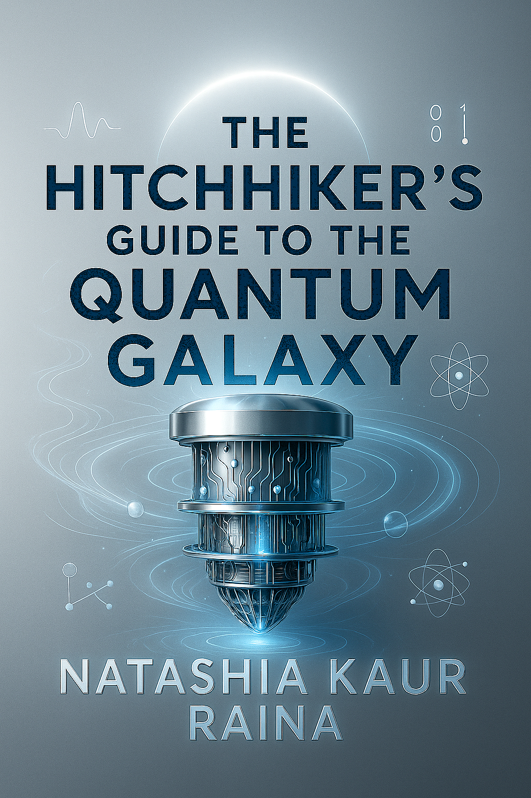

# The Ultimate Quantum Resources Repo

<b><h3>The Hitchhiker's Guide to the Quantum Galaxy</h3></b>

Your Ultimate Quantum Resource Hub. A curated, ever-growing collection of the best quantum computing resources from beginner roadmaps to advanced research papers, tools, SDKs, projects, and career guides.  Perfect for students, researchers, and quantum-curious minds.

<b><h3>Quantum Learning Roadmaps</h3></b>
https://youtu.be/ZCkYT5VIQLQ?feature=shared

<b><h3>Quantum Books</h3></b>
https://youtube.com/shorts/moa6aLZM29E?feature=shared

<b><h3>Quantum Courses</h3></b>
https://youtu.be/w_KrPZJJbEk?feature=shared

<b><h3>Quantum Youtubers & Channels</h3></b>

<b><h3>Quantum Hackathons</h3></b>
https://youtu.be/McfbW1hjRTw?feature=shared

<b><h3>Quantum Repos to Contribute to(QSDKs an much more)</h3></b>
Qiskit
CLassiq
Cirq
Pennylane

<b><h3>Quantum Masters degrees</h3></b>
https://youtube.com/playlist?list=PL7zofphMtPxG9y2qfrOZhOpNSZ3DLmqBD&feature=shared

<b><h3>Quantum Research Papers</h3></b>

<b><h3>Quantum Internships</h3></b>

<b><h3>Quantum Careers</h3></b>

<b><h3>Quantum Companies, Startups & Organisations</h3></b>

<b><h3>Quantum FAQs</h3></b>

<b><h3>Quantum Summer Schools</h3></b>

<b><h3>Quantum Computing Applications</h3></b>

<b><h3>Other Quantum Resource Repos</h3></b>

